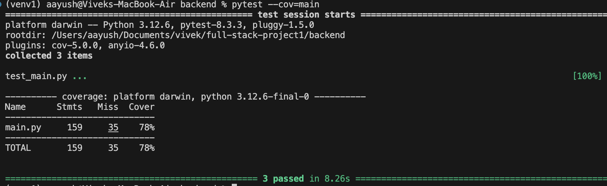

Here's a creative and engaging README for your full stack project using FastAPI as the backend and Next.js as the frontend:

---

# 🚀 Full Stack Code Runner & CP Problem Management System

🎉 Welcome to the **Code Runner & CP Problem Management System**! This is a full stack application designed to allow users to run code, solve programming challenges, and manage coding problems with a FastAPI backend and a Next.js frontend.

---

## 🌐 Live Demo

You can check the live version of the app hosted on Vercel:

🔗 [Live Demo](https://fastapi-nextjs-problems-frontend.vercel.app/)

---

### 🎥 Application Demo


---

## 🌟 Features

- 🌐 **FastAPI Backend**: High-performance backend that handles code execution and problem management.
- ⚡ **Real-time Code Execution**: Run code in multiple programming languages like C++ and Python.
- 🛠 **Problem Solving Platform**: Solve coding problems with automatic evaluation and feedback.
- 🔐 **CORS Middleware**: Secure connections between the frontend and backend with cross-origin resource sharing enabled.
- 🗂 **Organized API**: Endpoints for running, submitting, and fetching problems.

---

## 🖥️ Technologies Used

- **Backend**: [FastAPI](https://fastapi.tiangolo.com/) (Python)
- **Frontend**: [Next.js](https://nextjs.org/) (React)
- **Code Execution**: Supports **C++** and **Python** for now!
- **Styling**: TailwindCSS (for frontend)

---

### 💻 Deployment Platforms

- **Frontend**: [Vercel](https://vercel.com/)  
- **Backend**: [Glitch](https://glitch.com/)

---

## 🚀 API Endpoints

Here's a quick list of available API endpoints:

- **GET** `/`: Basic API test route that returns welcome message.
- **GET** `/api/hello`: Basic API test route.
- **GET** `/api/get-all-problems`: Fetch all coding problems.
- **GET** `/api/get-problem-description/{id}`: Fetch a problem's description by ID.
- **POST** `/api/run`: Run the code in supported languages (C++/Python) and return the output.
- **POST** `/api/submit`: Submit a solution for a problem, check it against test cases, and get feedback.

---

## 🔧 How to Run the Project Locally

1. **Clone the repository along with submodules**  
   Make sure to clone the repository including all submodules:
   ```bash
   git clone --recurse-submodules https://github.com/vivagarwal/cp_practice_platform.git
   ```

2. **Initialize submodules (if already cloned without submodules)**  
   If you’ve cloned the repository without submodules, you can initialize them separately:
   ```bash
   git submodule update --init --recursive
   ```

3. **Backend Setup (FastAPI)**

   1. Navigate to the backend directory:
      ```bash
      cd backend
      ```

   2. Create a virtual environment and activate it:
      ```bash
      python -m venv venv
      source venv/bin/activate  # On Windows use `venv\Scripts\activate`
      ```

   3. Install dependencies:
      ```bash
      pip install -r requirements.txt
      ```

   4. Set up your environment variables. Create a `.env` file in the backend directory, and add the necessary variables :
      ```bash
      OUTPUT_TEMP_DIR="path_to_temp_dir_for_compilation_output_etc"
      ```

   5. Start the FastAPI server:
      ```bash
      uvicorn main:app --reload
      ```

   The backend will now be running at `http://127.0.0.1:8000`.

4. **Frontend Setup (Next.js)**

   1. Navigate to the frontend directory:
      ```bash
      cd ../frontend
      ```

   2. Install dependencies:
      ```bash
      npm install
      ```

   3. Create a `.env.local` file in the frontend directory, and configure your environment variables for the frontend:
      ```bash
      NEXT_PUBLIC_API_URL=http://localhost:8000
      ```

   4. Start the Next.js development server:
      ```bash
      npm run dev
      ```

   The frontend will now be running at `http://localhost:3000`.

5. **Run the Full Stack Application**

   Once both the backend and frontend servers are running, open your browser and navigate to `http://localhost:3000` to view the full application.

---

### 🧪 Running Backend Tests

To ensure everything is working as expected, you can run the tests for the FastAPI backend.

1. **Navigate to the backend directory**:
   ```bash
   cd backend
   ```

2. **Run the tests**:
   We use `pytest` to run the tests and also include coverage information. Simply run:
   ```bash
   pytest --cov=main
   ```

### 📊 Test Coverage

The current test coverage for the backend code is shown below:



### 🛠️ Tools and Technologies

- **Testing Framework**: [`pytest`](https://docs.pytest.org/en/latest/)
- **Coverage Tool**: [`pytest-cov`](https://pytest-cov.readthedocs.io/en/latest/)
---

## 📦 Deployment

This app can be deployed using platforms like **Vercel** for the frontend and **Heroku** or **DigitalOcean** or **Glitch** for the backend. Ensure CORS is configured properly for secure communication.

---

## 📝 Example API Calls

Here are a few example API requests:

1. **Submit Code:**

   ```json
   POST /api/submit

   {
     "id": 1,
     "language": "cpp",
     "code": "#include<iostream>\nusing namespace std;\nint main() { cout << 'Hello, World!'; return 0; }"
   }
   ```

2. **Run Code:**

   ```json
   POST /api/run

   {
     "language": "py",
     "code": "print('Hello, World!')",
     "input": ""
   }
   ```

---

## 🤝 Contributing

Contributions are welcome! Feel free to fork this repo and submit a pull request.

---

## 🔒 License

This project is licensed under the MIT License. See the [LICENSE](LICENSE) file for more details.

---

## 📬 Contact

For any questions, feel free to reach out via email or open an issue in the repository.

---

🎉 **Thank you for checking out the project! Happy Coding!**

--- 

Feel free to modify any section or let me know if you'd like to add more specific details!